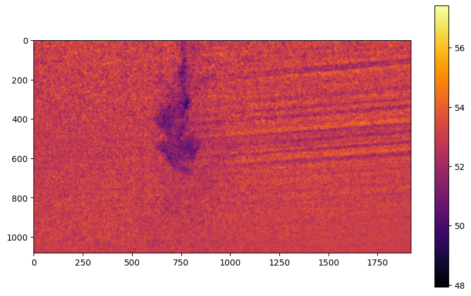
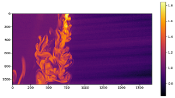

# One-Color LIF Method for Temperature Measurement

## Introduction
In this project, we used the one-color Laser-Induced Fluorescence (LIF) method to calculate the temperature of a fluid. This method leverages the fluorescent properties of certain particles, which, when excited by laser light at a specific wavelength, emit radiation in a particular range of electromagnetic waves. The intensity of this emitted light is dependent on temperature, allowing us to determine the fluid's temperature. This temperature dependence varies across different fluorescent materials; for most, the output radiation intensity increases as the temperature decreases.

## Test Theory
The quantum efficiency \( Q \) plays a central role in this experiment and is influenced by several parameters:

- $$\( K_{\text{spec}} \)$$: Intensity of fluorescent radiation received by the camera.
- $$\( K_{\text{opt}} \)$$: Optical efficiency due to optical equipment.
- $$\( \epsilon_1 \)$$ and $$\( \epsilon_2 \)$$: Absorption coefficients of the fluorescent material and laser light, respectively.
- $$\( C \)$$: Concentration of the fluorescent material.
- $$\( I_0 \)$$: Intensity of the incoming laser light.
- $$\( b \)$$ and $$\( z \)$$: Path lengths traveled by the beam in the container and the fluorescent radiation perpendicular to the laser sheet.

Given these parameters, the light emitted by the fluorescent materials is dependent on the temperature. This relationship is expressed by the equation:
$$
\[
\frac{I_f}{I_{f_{\text{ref}}}} = e^{\beta\left(\frac{1}{T} - \frac{1}{T_0}\right)}
\]
$$

Where:

- $4\( I_f \)$$: Fluorescence intensity in the test mode.
- $$\( I_{f_{\text{ref}}} \)$$: Fluorescence intensity in the reference mode.
- $$\( \beta \)$$: Experimentally determined coefficient.
- $$\( T \)$$ and $$\( T_0 \)$$: Test and reference temperatures, respectively.

When the temperature is constant but the concentration changes, the relationship becomes:
$$\[
\frac{I_f}{I_{f_{\text{ref}}}} = \frac{C}{C_{\text{ref}}}
\]$$

This method assumes a uniform concentration of fluorescent particles throughout the container and low fluctuations of laser light intensity.

## Test Equipment
The experimental setup involved creating a light sheet in the test container using a laser and a cylindrical lens. A camera, placed perpendicular to the laser sheet, captured images of the fluorescent emissions. 

Key equipment details:
- Fluorescent substance: Rhodamine B dissolved in water.
- A filter was placed on the camera to capture only fluorescent emissions.
- The experiment was conducted in a dark room to avoid interference from external light sources.

## Description of Experiment
1. **Preparation of Fluorescent Solution**:
    - Dissolve Rhodamine particles in water.
    - Stir with a magnetic stirrer until the solution becomes uniform.
    - Determine the solution concentration (reference concentration).

2. **Concentration Measurement**:
    - Inject a concentrated solution into a container with a dilute solution using a syringe.
    - Capture images of the fluorescent emissions.
    - Use the images and reference data to calculate the concentration at any point.

3. **Temperature Measurement**:
    - Stir the uniform solution with a magnetic stirrer and measure the initial temperature (26°C). Capture reference images.
    - Heat the solution to 53°C while stirring continues, ensuring uniform temperature.
    - Capture images at both temperatures to develop a calibration curve.
    - Inject cold fluid and capture additional images to determine temperature distribution using the calibration curve and experimental data.

## Results

### Temperature Contour Visualization
A contour map was generated to visualize the temperature distribution in the fluid. This visualization provides a detailed view of how temperature varies throughout the test container.

    
    
<i>Figure 1: Calculation of temperature by linear calibration (degrees Celsius)</i>

    
    
<i>Figure 1: Calculation of temperature by linear calibration (degrees Celsius)</i>

## Conclusion
By analyzing the captured images and employing the calibration curve, we accurately mapped the temperature distribution within the fluid using the one-color LIF method.
