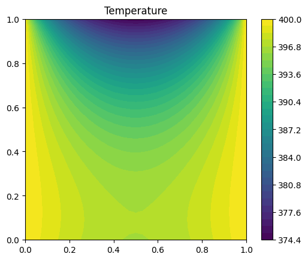
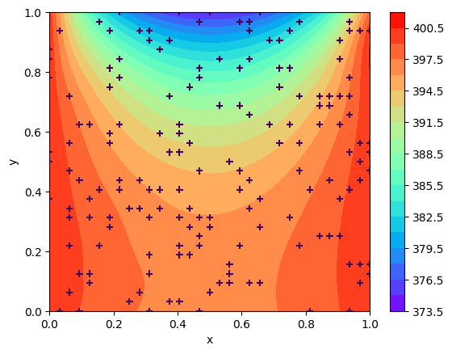
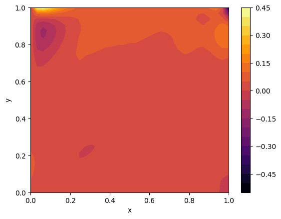

# Comparative Analysis of 2D Heat Transfer Modeling Using FEniCS and Physics-Informed Neural Networks (PINNs)

## Introduction

In this study, the 2D heat transfer problem is first solved with FEniCS. Afterwards, the temperature data on the domain is used as ground truth data for a Physics-Informed Neural Network (PINN). A comparison is made between the PINN and FEniCS data to evaluate the accuracy of the PINN model.

## Geometry Model

The 2D square-shaped plate with a size of (1 × 1) is considered in this problem. Boundary conditions in this setup are:

- Constant wall temperature $\( T = 400 \, \text{K} \) at \( x = 1 \) (0 < y < 1)$ and $\( x = 0 \) (0 < y < 1)$
- Convection boundary condition $\( h = 40 \, \text{W/m}^2 \cdot \text{K} \)$, $\( T_\infty = 300 \, \text{K} \)$
- Constant heat flux $\( q'' = 100 \, \text{W/m}^2 \) at \( y = 0 \) (0 < x < 1)$

## FEniCS Solver

For two-dimensional steady-state conditions with no generation and constant thermal conductivity, the governing equation of this model is:

$$
\nabla^2 T = 0
$$

In the two-dimensional model, the equation becomes:

$$
\frac{\partial^2 T}{\partial x^2} + \frac{\partial^2 T}{\partial y^2} = 0
$$

FEniCS is based on the finite element method, which is a general and efficient mathematical machinery for the numerical solution of PDEs. The starting point for the finite element methods is a PDE expressed in variational form. To obtain the variational form of the equation, first multiply the equation by the test function \(v\) and integrate over the boundary (\(\Omega\)):

$$
\int_\Omega \nabla^2 T \, dx = 0 \quad (x \in \Omega)
$$

Expanding the equation gives:

$$
-\int_\Omega \nabla T \cdot \nabla v \, dx + \int_{\partial \Omega} \frac{\partial T}{\partial n} v \, dx = 0 \quad (x \in \Omega)
$$

On the convection boundary condition, the right-hand term of the equation becomes:

$$
\int_{\partial \Omega} \frac{\partial T}{\partial n} v \, dx = -\int_{\partial \Omega} h(T - T_\infty) v \, dx - \int_{\partial \Omega} q'' v \, dx
$$

The variational form of the equation is:

$$
a(T, v) = L(T, v)
$$

$$
a(T, v) = \int_\Omega \nabla T \cdot \nabla v \, dx + \int_{\partial \Omega} hTv \, dx
$$

$$
L(T, v) = -\int_{\partial \Omega} q'' v \, dx + \int_{\partial \Omega} h T_\infty v \, dx
$$

The solution of FEniCS is shown in Figure 1.

  
  
<em>Figure 1: FEniCS Solution.</em>

## PINN Inverse Problem

PINNs directly embed physical laws within the loss function of neural networks. By minimizing the loss function, this approach allows the output variables to automatically satisfy physical equations. We consider an inverse problem with FEniCS ground truth data. Implementation of the PINN with these data obtains the temperature distribution over the domain.

A multi-layer perceptron (MLP) with two input neurons, seven hidden layers with 20 neurons each, and an output layer with one neuron is employed. Equation [2] is used as the loss function of PINN.

The MLP gets \(x\) and \(y\) as input data and obtains temperature (\(T\)) as output. Results of PINN are shown in Figure 2. Ground truth data are shown with `+` in Figure 3. Comparison of PINN and FEniCS is evaluated with the equation below, as shown in Figure 3.

$$
\text{Error} \ = \frac{T_{\text{PINN}} - T_{\text{FENICS}}}{T_{\text{FENICS}}} \times 100
$$

Maximum Error in the PINN model is 0.55%, which indicates the acceptable accuracy of the model.

  
  
<em>Figure 2: PINN Results.</em>

  
  
<em>Figure 3: Ground truth data, Comparison of PINN and FEniCS, and Errors between PINN and FEniCS.</em>

